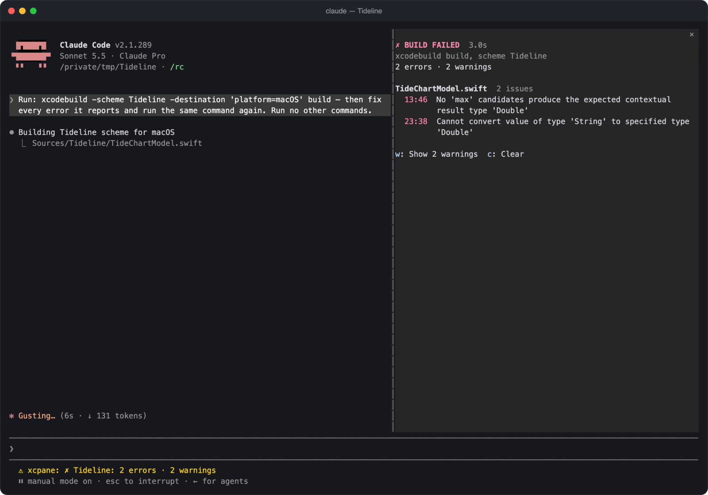

# xcode-build

[](https://github.com/griches/claude-xcode-mod)
[](https://github.com/griches/claude-xcode-mod/actions/workflows/ci.yml)
[](LICENSE)

A [Claude Code](https://code.claude.com) mod that turns `xcodebuild` and `swift build` output into a live pane of errors grouped by file, and hands Claude the diagnostics instead of the raw log.


## Why

When a Bash command fails with long output, Claude Code gives the model the start and the end and cuts out the middle. A failing `xcodebuild` puts the compiler errors in the middle, between hundreds of lines of `SwiftCompile` and `Copy` steps. Claude learns that the build failed and which files failed, but not why.

Measured on Xcode 27.1 with a five-file Swift package and three compile errors:

| | Without the mod | With the mod |
| --- | --- | --- |
| Raw log | 295 lines, 47 KB | the same |
| What Claude reads | 10,039 characters, none of them an error message | 499 characters, every reported error with its file, line and column |

Repeated ten times, the result without the mod had no error message in it in eight runs. The method, the demo project and a script to reproduce it are in [`Benchmarks/`](Benchmarks/README.md).

## What it does



- **Reads Xcode's result bundle.** Adds `-resultBundlePath` to `xcodebuild` commands that name none, then reads errors, warnings and test failures from the bundle with `xcresulttool`. The bundle goes to the temporary folder and is deleted once read.
- **Condenses what Claude reads.** The tool result becomes the verdict, every error as `file:line:column: error: message`, the failed tests, and a count of warnings per file. The transcript keeps the raw output.
- **Shows a pane.** Errors grouped by file, failed tests, the slowest tests, line coverage when the run collected it, a toggle for warnings, a running timer while a build is in flight, and the last few builds.
- **Gives Claude a tool for the rest.** The summary counts warnings without listing them, so the mod adds a tool, `mcp__xcode-build__details`, that Claude can call for every warning, error and failed test of the last build. The summary tells Claude it is there.
- **Follows builds through Xcode's MCP too.** When Claude builds or tests through Apple's Xcode MCP server (`BuildProject`, `RunAllTests`, `RunSomeTests`), the result is left as it is and shown in the same pane, status line and toast.
- **Sets the status line** on a failure and shows a toast on a success.
- **Draws a compact transcript row.** The verdict and the first three errors, in place of the raw log. This applies to a build drawn as its own row; in the fullscreen layout Claude Code folds shell commands into one line ("Ran 1 shell command"), and the row is not drawn there.

It also reads `swift build` and `swift test` from their log output, and a build piped through `tail`, `xcbeautify` or `xcpretty` is still read from the result bundle.

## How this compares to Apple's Xcode MCP

Xcode ships its own MCP server (`xcrun mcpbridge`) that lets Claude build, test and read parsed results through Xcode's tools. From Xcode 27 it can run headless, with Xcode closed, after a one-time `sudo xcrun mcp-server enable`.

If Claude builds through that server, you don't need this mod's log condensing: the MCP already returns structured results. The mod still shows those builds in its pane. The two solve the problem at different points:

| | Apple's Xcode MCP | xcode-build |
| --- | --- | --- |
| Fixes | Builds Claude runs through the MCP's build tool | Builds Claude runs as `xcodebuild` or `swift build` in Bash |
| Setup | Enable in Xcode; headless mode needs sudo and per-agent approval | Clone and point Claude Code at the folder |
| Scope | Builds, tests, previews, project navigation, documentation | Build and test results only |
| Interface | None in Claude Code | A live pane, status line and toast in the terminal |

Use the MCP if you have it set up and Claude uses it to build. This mod helps when Claude reaches for `xcodebuild` in the shell, which it often does, and it adds the pane whichever way Claude builds.

### When the MCP isn't an option

- **No admin rights.** Headless mode is turned on with `sudo`, and approving an agent or folder needs it too. Many company-managed Macs don't give developers admin access.
- **MCP servers restricted.** An organisation can control which MCP servers Claude Code may use, and some block any that haven't been reviewed.
- **A broader grant.** The MCP lets an agent drive Xcode itself. This mod adds one flag to an `xcodebuild` command Claude was already allowed to run, reads the result locally with Apple's `xcresulttool`, and sends nothing over the network.
- **Older Xcode.** Before Xcode 27 the MCP needs Xcode open.

### Why a live pane in the terminal

- **You see what Claude sees.** The pane shows the same errors Claude was handed, so you can tell at a glance whether it is fixing the right thing.
- **No scrolling.** Build output otherwise sits folded in the transcript. The verdict, error count and files stay visible while the conversation moves on.
- **Progress while you wait.** A timer runs during the build, then the pane turns red or green.
- **History.** The last few builds are listed, so you can watch a fix go from two errors to one to green.
- **Tests and warnings in the same place.** Failed tests show their assertion message, and warnings are one keypress away.
- **No window switching.** It sits beside the conversation, which matters most over SSH or when Xcode isn't open.

An MCP server returns data to the model and cannot draw interface in Claude Code. That part is specific to mods.

## How this compares to xcsift and xcbeautify

[xcsift](https://github.com/ldomaradzki/xcsift) and [xcbeautify](https://github.com/cpisciotta/xcbeautify) are command-line tools you pipe `xcodebuild` output through. xcsift is built for coding agents and does more than this mod in several places; this mod's difference is that it lives inside Claude Code.

| | xcode-build | xcsift | xcbeautify |
| --- | --- | --- | --- |
| What it is | A Claude Code mod | A command-line tool | A command-line tool |
| Made for | Claude Code | Coding agents and CI | People and CI |
| How a build reaches it | By itself, when Claude runs `xcodebuild` | The command is piped through it | The command is piped through it |
| Where results come from | Xcode's result bundle, the log as a fallback | The build log, plus coverage files | The build log |
| Live pane in Claude Code | Yes | No | No |
| Other agents, CI, Linux | No | Yes | CI yes |
| Coverage | A single line-coverage figure | Detailed reports | No |

If you use several agents, or want the same output in CI, xcsift is the better fit. If you work in Claude Code and want the errors in front of you as well as in front of Claude, use this.

## Requirements

- macOS with Xcode and its command line tools (`xcodebuild`, `xcrun`).
- Claude Code with mod support. Built and tested on 2.1.288; check yours with `claude --version` and update with `claude update`.
- For the result bundle, an Xcode whose `xcresulttool` has `get build-results` (tested on Xcode 27.1). Without it the mod falls back to reading the log.

## Install

Clone the repository somewhere it can stay:

```sh
git clone https://github.com/griches/claude-xcode-mod.git ~/.claude/mods/claude-xcode-mod
```

### Try it for one session

```sh
cd /path/to/your/xcode/project
claude --plugin-dir ~/.claude/mods/claude-xcode-mod
```

### Load it in every session

Add the folder to `CLAUDE_CODE_PLUGIN_DIRS` in the `env` block of `~/.claude/settings.json`. The path must be absolute; `~` is allowed.

```json
{
  "env": {
    "CLAUDE_CODE_PLUGIN_DIRS": "~/.claude/mods/claude-xcode-mod"
  }
}
```

If the variable already names other folders, separate them with `:`. Restart Claude Code afterwards. This also covers sessions started from the desktop app.

### Check it loaded (optional)

Type `/xcode-build` in a session. If the mod is loaded, the pane opens and says "No builds yet." You only need to do this once, to confirm the install.

## Use

There is nothing to switch on. Once the mod is loaded it works by itself whenever Claude runs `xcodebuild`, `swift build` or `swift test`, however you ask:

```
Build the app and fix any errors.
```

Each time Claude builds:

- Claude reads the parsed errors in place of the raw log.
- The status line shows a failure, and a toast shows a success.
- The pane opens by itself on terminals at least 144 columns wide. On narrower terminals it stays closed until you type `/xcode-build`, and then shows above the prompt.

The commands and keys are only for the pane:

| What | How |
| --- | --- |
| Open the pane | `/xcode-build` |
| Forget the builds | `/xcode-build clear` |
| Show or hide warnings | Focus the pane (`ctrl+x` then `tab`), press `w` |
| Clear from the pane | Focus the pane, press `c` |
| Close the pane | `ctrl+x` then `x`, or click its `✕` |

## Options

Each option is a row in Claude Code's config menu (`/config`).

| Option | Default | Meaning |
| --- | --- | --- |
| `condense` | `true` | Replace the raw log Claude reads with the parsed diagnostics |
| `warnings` | `count` | `count`: Claude reads how many warnings each file has. `list`: every warning |
| `resultBundle` | `true` | Add `-resultBundlePath` to `xcodebuild` commands that name none |
| `autoOpen` | `always` | Open the pane `always` (when a build starts), on `failure`, or `never` |
| `compactRow` | `true` | Draw the verdict in the transcript instead of the raw log |

## Permissions

The mod changes the command Claude runs by appending one flag: `-resultBundlePath '<temporary folder>/claude-xcode-build/<id>.xcresult'`. An allow rule such as `Bash(xcodebuild:*)` still matches. A rule that names one exact command will no longer match and Claude Code will ask; set `resultBundle` to `false` to leave commands untouched.

## Update and uninstall

```sh
git -C ~/.claude/mods/claude-xcode-mod pull
```

To uninstall, remove the folder from `CLAUDE_CODE_PLUGIN_DIRS` and delete the clone.

## Troubleshooting

- **`/xcode-build` is not a command.** The mod did not load. Run `claude plugin validate ~/.claude/mods/claude-xcode-mod`, check the path in your settings, and check `claude --version`.
- **The pane does not open by itself.** Your terminal is narrower than 144 columns, or `autoOpen` is not `always`. Type `/xcode-build`.
- **A build is not picked up.** See Limits. `claude --debug` logs why a hook was skipped.
- **Claude still reads the raw log.** The mod only condenses when it found errors or failed tests, or the build succeeded. A failure with no diagnostics passes through unchanged.

## Limits

- Only builds Claude runs through the Bash tool are seen. Builds you start in Xcode are not.
- A build inside a script, `make`, `fastlane`, `bash -c` or `$(...)` is not recognised, and neither is one run in the background.
- A command with several `xcodebuild` invocations is read from its log only.
- When a failing build yields no diagnostics, Claude reads the raw log unchanged.
- `swift build` has no result bundle, so a long failing log that Claude Code cuts in the middle can still lose its errors.
- The mod API is early access and may change between Claude Code releases.

## Develop

```sh
claude plugin validate .
claude plugin test .
```

`hooks/register.tsx` holds the hooks; `shell.ts` finds builds in a command, `xcresult.ts`, `log.ts` and `mcp.ts` read results, and `format.ts` words them. The fixtures in `tests/fixtures.ts` are excerpts of real Xcode output.

## License

[MIT](LICENSE)
